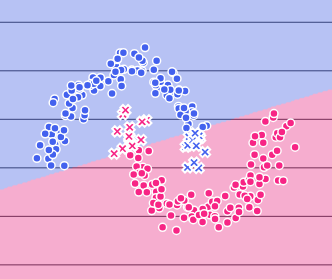
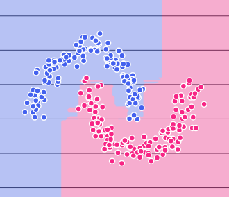
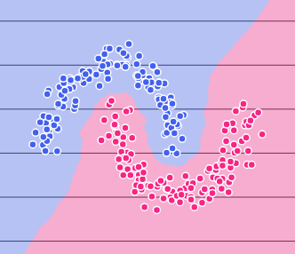
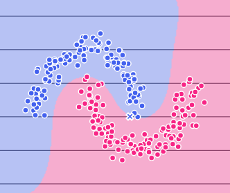
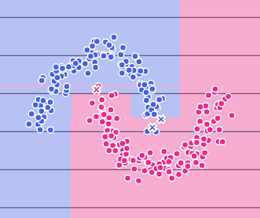

<div align="center">

# ML Model Visualizer

### *Experiment. Visualize. Understand.*

**An interactive, browser-based sandbox for exploring machine learning classifiers — visualize decision boundaries in real time, fine-tune hyperparameters, and build deep intuition for algorithmic learning.**

<br>

[](https://ml-model-visualizer-fzci.onrender.com)

<br>

[](https://github.com/chintanchoughule30-source)
[](https://www.python.org/)
[](https://streamlit.io/)
[](https://scikit-learn.org/)
[](./LICENSE)
[](./CONTRIBUTING.md)

<br>

🌐 **Live Application:** [https://ml-model-visualizer-fzci.onrender.com](https://ml-model-visualizer-fzci.onrender.com)

</div>

---

<div align="center">

### 🎯 Live App Preview

**[➡️ Click here to launch the live application](https://ml-model-visualizer-fzci.onrender.com)**

> *Pick a dataset · Select a classifier · Tune hyperparameters · Watch the decision boundary update in real time — all in your browser, no setup required.*

</div>

---

## 📌 Overview

**ML Model Visualizer** is an interactive educational web application built with Streamlit and scikit-learn. It empowers students, educators, and machine learning practitioners to experiment with over 10 classification algorithms without writing a single line of boilerplate code.

Load standard synthetic or real benchmark datasets, select any classifier, tweak hyperparameters through intuitive visual controls, and observe how **decision boundaries**, **evaluation metrics**, and **model diagnostics** transform instantaneously.

> *"The best way to understand an algorithm is to experiment with its boundaries."*

---

## ✨ Features

- **10+ Supported Classifiers**:
  - Logistic Regression, K-Nearest Neighbors (KNN), Decision Tree, Random Forest
  - Gradient Boosting, Support Vector Classifier (SVM Linear & RBF)
  - Naive Bayes, Linear Discriminant Analysis (LDA), AdaBoost, Voting Classifier
- **Real-Time Decision Boundary Plots**: High-resolution 2D feature space mapping showing training and testing points overlaid with probability heatmaps.
- **Interactive Hyperparameter Tuning**: Adjust regularization (`C`, `penalty`), tree depths, neighbor counts (`k`), estimators, and kernel settings on the fly.
- **Rich Dataset Options**:
  - Built-in synthetic datasets: *Moons*, *Circles*, *Blobs*, *XOR*, *Linear*
  - Built-in scikit-learn benchmark datasets (e.g. *Wine*, *Iris*, *Breast Cancer*)
  - Custom dataset upload support (`.csv`) with automatic feature selection
- **Model Insights & Diagnostics**:
  - Comprehensive metrics: Accuracy, Precision, Recall, F1-Score (Train vs. Test)
  - Confusion Matrix, ROC curves, and Precision-Recall curves
  - Feature importances and learning/validation curve hints
- **Exportable Production Code**: Instant generation of reproducible, copy-pasteable Python scripts reflecting your active dataset and hyperparameter configuration.
- **Sleek Terminal Aesthetic**: Modern dark UI engineered for distraction-free experimentation.

---

## 🖼️ Decision Boundary Visualizations

Here is a glimpse of how different classifiers partition identical feature spaces:

<br>

<div align="center">

| Model | Visualization |
|:------|:-------------:|
| **Logistic Regression** — Clean linear boundary; high interpretability. |  |
| **Random Forest** — Ensemble orthogonal splits; robust and variance-controlled. |  |
| **K-Nearest Neighbors (k=5)** — Highly local, non-parametric boundary responsive to density. |  |
| **SVM (RBF Kernel)** — Smooth, maximally-separated non-linear boundaries via kernel trick. |  |
| **Decision Tree** — Strict axis-aligned splits; intuitive but sensitive to depth. |  |

</div>

---

## 🛠️ Tech Stack

| Layer | Technology |
|:------|:-----------|
| **Application Framework** | [Streamlit](https://streamlit.io/) |
| **Machine Learning** | [scikit-learn](https://scikit-learn.org/) |
| **Numerical Processing** | [NumPy](https://numpy.org/) |
| **Data Manipulation** | [Pandas](https://pandas.pydata.org/) |
| **Visualization & Charting** | [Plotly](https://plotly.com/python/) & [Matplotlib](https://matplotlib.org/) |
| **Programming Language** | [Python 3.9+](https://python.org/) |

---

## 🚀 Getting Started

> 💡 **Try it instantly without local setup:** Access the live deployment at **[ml-model-visualizer-fzci.onrender.com](https://ml-model-visualizer-fzci.onrender.com)**.

To set up and run the project locally on your machine, follow the steps below:

### Prerequisites

Ensure you have **Python 3.9+** and **git** installed:
```bash
python --version
git --version
```

### Installation

1. **Clone the repository**
   ```bash
   git clone https://github.com/chintanchoughule30-source/ML-model-visualizer.git
   cd ML-model-visualizer
   ```

2. **Create and activate a virtual environment** *(recommended)*
   ```bash
   # macOS / Linux
   python3 -m venv venv
   source venv/bin/activate

   # Windows (Command Prompt / PowerShell)
   python -m venv venv
   .\venv\Scripts\activate
   ```

3. **Install dependencies**
   ```bash
   pip install -r requirements.txt
   ```

4. **Launch the application**
   ```bash
   streamlit run app.py
   ```

The application will launch in your default web browser at `http://localhost:8501`.

---

## 📖 How to Use

1. **Select / Upload Dataset**:
   Navigate to the **Dataset** tab in the sidebar. Choose a synthetic generator (Moons, Circles, XOR, Blobs) or upload a custom CSV dataset. Configure sample size, noise levels, and train/test split.
2. **Configure Classifier**:
   Switch to the **Train Model** page. Select an algorithm from the model dropdown.
3. **Tune Hyperparameters**:
   Use sidebar sliders to alter parameters. Observe how boundaries, margins, and tree depths update.
4. **Evaluate Diagnostics**:
   Examine training vs. test accuracy, confusion matrices, and ROC metrics to identify overfitting or underfitting.
5. **Export Python Code**:
   Click **Export Model Code** to grab ready-to-run Python code reproducing your exact model pipeline.

---

## 📁 Project Architecture

```
ml-model-visualizer/
├── .devcontainer/              # Devcontainer configuration for cloud environments
├── .streamlit/
│   └── config.toml             # Custom Streamlit UI & theme setup
├── assets/                     # Visual assets, screenshots, and walkthrough demo
│   ├── readme/                 # Boundary comparisons & tutorial GIF
│   └── *.png                   # Dataset thumbnails & icon assets
├── datasets/                   # Synthetic & real benchmark dataset loaders
│   ├── real.py                 # Scikit-learn benchmark datasets
│   └── synthetic.py            # Custom non-linear 2D generators
├── models/                     # Model registry, builder, and evaluation pipeline
│   ├── builder.py              # Pipeline constructor & scaler wrapper
│   ├── evaluator.py            # Train/test metrics & matrix computations
│   └── registry.py             # Hyperparameter specs & model definitions
├── pages/                      # Streamlit multipage views
│   ├── home.py                 # Overview & interactive model guide
│   ├── dataset.py              # Dataset preview & parameter controls
│   └── model.py                # Model training, boundary plotting & diagnostics
├── utils/                      # Core plotting, export, and insight utilities
│   ├── boundary_plot.py        # 2D contour & decision boundary rendering
│   ├── code_export.py          # Dynamic Python script generator
│   └── insights.py             # Feature importance & model advice
│   └── plot_utils.py           # Dataset visualizers
├── .gitignore                  # Git ignore specification
├── .python-version             # Python version pin for cloud deployment
├── app.py                      # Application entry point & global styling
├── CONTRIBUTING.md             # Contribution guidelines
├── LICENSE                     # MIT License (Chintan Choughule)
├── README.md                   # Project documentation
├── render.yaml                 # Render cloud deployment blueprint
└── requirements.txt            # Python dependencies
```

---

## 🤝 Contributing

Contributions, bug reports, and feature requests are welcome!
Feel free to check out the [issues page](https://github.com/chintanchoughule30-source/ML-model-visualizer/issues) or read [CONTRIBUTING.md](./CONTRIBUTING.md) to get started.

---

## 👤 Author & Maintainer

**Chintan Choughule**

- **GitHub**: [@chintanchoughule30-source](https://github.com/chintanchoughule30-source)
- **Email**: [chintanchoughule30@gmail.com](mailto:chintanchoughule30@gmail.com)

If you found this project helpful or educational, consider giving it a ⭐️ on GitHub!

---

## 📄 License

This project is authored by and licensed under the **MIT License** to **Chintan Choughule**. See the [LICENSE](./LICENSE) file for complete terms and permissions.
